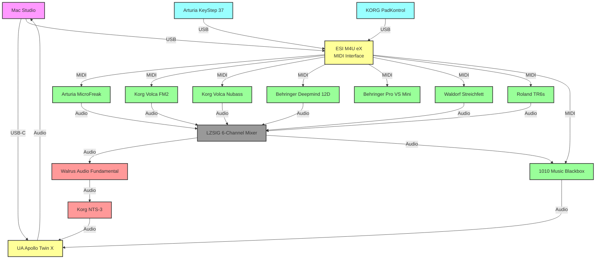

# Music Studio Setup Documentation

A comprehensive guide for setting up and operating a hybrid hardware/software music production studio centered around a Mac Studio and Universal Audio Apollo interface.

## Table of Contents
- [Overview](#overview)
- [System Diagram](#system-diagram)
- [Connection Guide](#connection-guide)
  - [USB Connections](#usb-connections)
  - [MIDI Cables](#midi-cables)
  - [Audio Cables](#audio-cables)
- [Power Requirements](#power-requirements)
- [Setup Instructions](#setup-instructions)
- [Workflow Guide](#workflow-guide)

## Overview

This studio setup combines modern digital audio workstation capabilities with analog synthesis and effects processing. The system is built around a Mac Studio as the central hub, utilizing a Universal Audio Apollo Twin X for professional audio conversion and the ESI M4U eX for extensive MIDI routing capabilities.

## System Diagram

## Connection Guide

### USB Connections
| Device | Cable Type | Quantity | Notes |
|--------|------------|----------|--------|
| UA Apollo Twin X | USB-C to USB-C | 1 | Thunderbolt connection preferred |
| ESI M4U eX | USB-B to USB-A | 1 | USB 3.0 recommended |
| Arturia KeyStep 37 | USB-B to USB-A | 1 | Also provides power |
| KORG PadKontrol | USB-B to USB-A | 1 | Also provides power |
| 1010 Music Blackbox | USB-C to USB-A | 1 | For file transfer and updates |

### MIDI Cables
| Connection | Cable Type | Quantity | Notes |
|------------|------------|----------|--------|
| ESI M4U eX to MicroFreak | 5-pin DIN MIDI | 1 | |
| ESI M4U eX to Volca FM2 | 5-pin DIN to 3.5mm MIDI | 1 | Requires MIDI adapter |
| ESI M4U eX to Volca Nubass | 5-pin DIN to 3.5mm MIDI | 1 | Requires MIDI adapter |
| ESI M4U eX to Deepmind 12D | 5-pin DIN MIDI | 1 | |
| ESI M4U eX to Pro VS Mini | 5-pin DIN MIDI | 1 | |
| ESI M4U eX to Streichfett | 5-pin DIN MIDI | 1 | |
| ESI M4U eX to TR6s | 5-pin DIN MIDI | 1 | |

### Audio Cables
| Connection | Cable Type | Quantity | Notes |
|------------|------------|----------|--------|
| Synths to LZSIG Mixer | 1/4" TRS or 3.5mm to 1/4" | 8 | Check each synth's output type |
| LZSIG to Walrus Fundamental | 1/4" TRS | 2 | Stereo pair |
| Walrus to NTS-3 | 1/4" TRS | 2 | Stereo pair |
| NTS-3 to Apollo Twin | 1/4" TRS | 2 | Stereo pair |

## Power Requirements
| Device | Power Type | Notes |
|--------|------------|--------|
| UA Apollo Twin X | External PSU | Included PSU required |
| ESI M4U eX | USB Powered | No additional PSU needed |
| Arturia KeyStep 37 | USB Powered | No additional PSU needed |
| KORG PadKontrol | USB Powered | No additional PSU needed |
| Arturia MicroFreak | 12V DC | PSU included |
| Korg Volca FM2 | 9V DC or 6x AA | Power supply recommended |
| Korg Volca Nubass | 9V DC or 6x AA | Power supply recommended |
| Behringer Deepmind 12D | IEC Power Cable | Standard computer power cable |
| Behringer Pro VS Mini | 12V DC | PSU included |
| Waldorf Streichfett | 12V DC | PSU included |
| Roland TR6s | USB-C or 9V DC | Can use USB power |
| 1010 Music Blackbox | USB-C | Power via USB-C |
| LZSIG Mixer | 12V DC | PSU included |
| Walrus Fundamental | 9V DC | Standard pedal power |
| Korg NTS-3 | USB-C or Battery | USB power recommended |

## Setup Instructions

1. **Computer Setup**
   - Install Universal Audio Console software
   - Configure MIDI devices in DAW preferences
   - Set audio interface buffer size based on needs

2. **Hardware Connection Order**
   - Connect and power on Apollo Twin X first
   - Connect MIDI interface and controllers
   - Power on synthesizers and effects
   - Configure MIDI channels on each device

3. **Signal Flow Configuration**
   - Set appropriate levels on LZSIG mixer
   - Configure effects send/return levels
   - Test MIDI routing through ESI interface
   - Verify audio paths through system

## Workflow Guide

1. **Recording Setup**
   - Route desired synths to mixer channels
   - Set appropriate gain staging
   - Configure effects chain as needed
   - Arm DAW tracks for recording

2. **MIDI Control**
   - KeyStep 37 for melodic input
   - PadKontrol for drum programming
   - Configure MIDI channels per instrument
   - Use DAW for MIDI sequencing

3. **Audio Processing**
   - Use Walrus Fundamental for analog coloration
   - NTS-3 for digital effects processing
   - Blackbox for sampling and resampling
   - Apollo Twin effects for final processing
